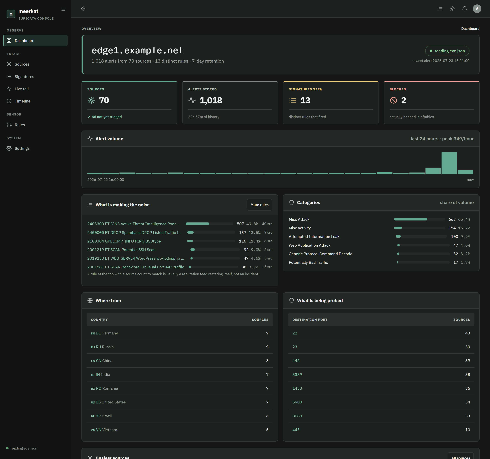

<div align="center">

# meerkat

**A console for [Suricata](https://suricata.io/) that runs _on_ your router.**

It follows `eve.json`, enriches every alert with ASN, country and city, stores it in
SQLite, and serves a web UI — whose home page is a list of **source addresses**,
not a list of events.

Named for *Suricata suricatta* — the meerkat, the sentry that stands watch and alarm-calls.

[](https://github.com/floreabogdan/meerkat/actions/workflows/ci.yml)
[](https://github.com/floreabogdan/meerkat/releases)
[](go.mod)
[](LICENSE)
[](https://buymeacoffee.com/floreabogdan)

<br>


</div>

---

## The argument

Measured on a live edge router: **891 alerts in four minutes**, of which

| share | category | what it is |
| --- | --- | --- |
| 68.8% | ET CINS | "source is on a reputation list" |
| 16.3% | ET DROP | Dshield blocklist, same idea |
| 10.6% | GPL ICMP | someone pinging |
| 2.6% | SURICATA | engine events (invalid ack, checksums) |
| **1.4%** | **ET SCAN** | **actual scanning** |
| **0.3%** | **ET COMPROMISED** | **actual compromise indicator** |

Piping that to a chat channel was tried and flooded it in minutes. The lesson is not
"filter harder" — it is that a chat channel is the wrong tool. Rolled up per source
address, those 891 rows become a few dozen, each one a decision: **block, acknowledge,
allowlist, or ignore.**

That is the whole product. Everything else follows from it.

<table>
<tr>
<td width="50%"><br><sub><b>One source: what it tripped, which ports, what was done about it.</b></sub></td>
<td width="50%"><br><sub><b>The installed ruleset, joined to how much each rule has actually cost you.</b></sub></td>
</tr>
<tr>
<td width="50%"><br><sub><b>The overview: volume, what is making the noise, where from, what is being probed.</b></sub></td>
<td width="50%" valign="top"><br>

**Observe**
- Sources rolled up: first/last seen, alerts, signatures, ports, worst severity, state
- Filter by country, AS, port, signature, severity, state, window, minimum volume
- Live tail, operator timeline, per-signature breakdown

**Act**
- Block, unblock, acknowledge, allowlist — one source or in bulk, with a reason and an expiry
- A block is a call to **nftables**, never a Suricata `drop`
- Per-signature dispositions: notify, digest, or mute the reputation feeds in one click

**Manage the sensor**
- The whole installed catalogue, enable/disable a rule or a category, override a severity
- Applied by rebuilding with `suricata-update` and reloading live — then read back from disk

</td>
</tr>
</table>

## Read this before you install it

> [!WARNING]
> **meerkat is beta software. Expect bugs.** It is a personal project released in the hope
> it is useful to someone else. Nothing here has been through the kind of testing a piece
> of security infrastructure deserves.

> [!CAUTION]
> **meerkat can change your firewall.** Blocking is an authenticated call to
> [nftably](https://github.com/floreabogdan/nftably), which owns the netfilter set. If you
> configure that and then mark a rule "always block", meerkat will ban source addresses
> without anyone watching. Both of those are off until you turn them on, and every attempt
> is recorded in the actions ledger — but know that the switch is there.

> [!CAUTION]
> **meerkat rewrites `/etc/suricata/disable.conf` and `enable.conf`.** From the first apply
> onwards, meerkat's generated filter files are the whole truth. It adopts what it finds
> there once, on first run, and warns about any line it cannot represent — but a filter file
> you hand-maintain will be replaced. Suricata's own `.rules` files are never touched.

**There is no support.** No warranty, no SLA, no guarantee of fitness for anything. Issues
and pull requests are welcome and may be ignored. See [LICENSE](LICENSE).

## Install

> 📖 **Full guide:** [`docs/USAGE.md`](docs/USAGE.md) walks through every dependency, every
> command-line flag, every setting, and what to do when a check fails.

meerkat runs on the router, next to Suricata. Pick one of these.

<details open>
<summary><b>Linux package (.deb / .rpm / .apk)</b></summary>

Each release ships packages for amd64, arm64 and armhf. They install the binary to
`/usr/bin/meerkat`, two systemd units and a path unit, and create a `meerkat` system user
in the `adm` group — which is what makes Debian's `0640 root:adm` `eve.json` readable:

```sh
# Debian / Ubuntu
sudo apt install ./meerkat_*_amd64.deb
# RHEL / Fedora
sudo dnf install ./meerkat-*.x86_64.rpm
```

The package does **not** start meerkat. Set it up first:

```sh
sudo meerkat init          # create the admin account
sudo meerkat doctor        # check eve.json access, geo databases, nftably
sudo systemctl enable --now meerkat
```

It recommends `suricata` but does not require it: meerkat is useful against a stopped
sensor, and can be pointed at an `eve.json` copied off another box. (The `.apk` is provided
for convenience; Alpine uses OpenRC, so you supply your own service under it.)
</details>

<details>
<summary><b>Download a binary</b></summary>

Grab the archive for your platform from the
[latest release](https://github.com/floreabogdan/meerkat/releases/latest)
(linux amd64/arm64/arm, freebsd, macOS), verify it against `SHA256SUMS.txt`, and drop the
binary on the router:

```sh
tar -xzf meerkat_*_linux_amd64.tar.gz
sudo install meerkat /usr/local/bin/meerkat
```
</details>

<details>
<summary><b>go install</b></summary>

Requires Go 1.25+. The binary is static (`CGO_ENABLED=0`); SQLite is
[modernc.org/sqlite](https://modernc.org/sqlite), so there is nothing to link against.

```sh
go install github.com/floreabogdan/meerkat/cmd/meerkat@latest
```

Or cross-compile from anywhere and copy one file to the router:

```sh
CGO_ENABLED=0 GOOS=linux GOARCH=amd64 go build -trimpath \
  -ldflags="-s -w -X github.com/floreabogdan/meerkat/internal/buildinfo.Commit=$(git rev-parse HEAD)" \
  -o meerkat ./cmd/meerkat
scp meerkat root@router:/usr/local/bin/meerkat
```
</details>

<details>
<summary><b>Docker</b></summary>

A multi-arch image is published to the GitHub Container Registry. meerkat has to **read the
host's `eve.json`**, so mount it read-only and make sure the container user can open it:

```sh
# one-time: create the database and admin account
docker run --rm -it -v meerkat-data:/var/lib/meerkat \
  ghcr.io/floreabogdan/meerkat:latest init --label edge1

# run it, reachable only on the host's loopback
docker run -d --name meerkat --restart unless-stopped \
  -p 127.0.0.1:8100:8100 \
  -v meerkat-data:/var/lib/meerkat \
  -v /var/log/suricata/eve.json:/var/log/suricata/eve.json:ro \
  --group-add "$(getent group adm | cut -d: -f3)" \
  ghcr.io/floreabogdan/meerkat:latest
```

Rule management does not work in a container: the privileged apply step needs the host's
`/etc/suricata` and Suricata's control socket. The console says so rather than pretending.
</details>

Then open `http://<router>:8100`. meerkat **listens on port 8100 on every interface** and
has **no TLS**, so the first thing to do after logging in is narrow who can reach it —
Settings → Access control, or bind loopback and use an SSH tunnel. It says so on the
console and once in the startup log until you do.

## What works today

**Ingest**
- **Follows `eve.json`** the way `tail -F` does: survives rotation, truncation, Suricata
  being stopped, and half-written records, and remembers its read offset so a restart
  neither replays the file nor skips what arrived while it was down.
- **Rejects non-alerts without decoding them.** On a busy router 98.5% of `eve.json` is flow
  and stats records; decoding a 40 KB stats blob just to discard it would dominate the cost.
- **Applies backpressure rather than dropping.** When the writer falls behind the tailer
  stops reading — the data is still on disk. A console that quietly discards under load is
  worse than no console.
- **Enriches** each source with ASN, organisation, country and (with a city database) city
  and coordinates, from local `.mmdb` files. Lookups never leave the box.
- **Retention** by age, with a hard cap as a flood backstop. Rollups survive pruning: a
  source someone triaged is a decision, and decisions outlive the alerts that prompted them.

**Triage**
- **Rolls up per source**: first and last seen, alert count, distinct signatures, distinct
  ports, worst severity, triage state. Maintained incrementally, so the home page stays fast
  under a flood.
- **Sources console** — filter by country, AS, destination port, signature, severity, state,
  time window and minimum volume; sort by any column; page through the result.
- **Source detail** — activity over time, which signatures, which ports, the geo/AS identity,
  the individual alerts with their protocol context, and the ledger of what was done.
- **Block, unblock, acknowledge, allowlist** — individually or in bulk, with a reason and an
  optional expiry. A block is a call to nftably; meerkat marks a source blocked only once
  that call has succeeded, and reconciles against nftably's real blacklist every two minutes
  so the claim stays true.
- **Per-signature dispositions** — notify, digest or mute. Muting the reputation feeds is one
  click, and changes what interrupts you rather than what is kept.
- **Live tail** for watching the sensor in real time, and an **operator timeline** of every
  login, settings change, triage decision and retention pass.

**The sensor's ruleset**
- The whole installed catalogue — 68,005 rules on the router this was built for — read from
  the file Suricata actually loaded, and joined to how much each rule has cost you.
- Enable or disable a rule or a whole category with a reason, override a severity, or mark a
  rule so that anything tripping it is **blocked on sight** (in nftables, never as a Suricata
  `drop`).
- Changes are applied by rebuilding with `suricata-update` and reloading the sensor live,
  then **read back from disk** to check they took.
- Scheduled ruleset updates, a history of every run, and a diff of what is waiting to apply.

**Elsewhere**
- **Threat-map publishing** — gzipped batches to a collector, reading from a persisted cursor,
  withholding your own networks and never carrying a destination address. Off by default, and
  the prefixes to withhold are yours to set: the shipped default covers private space only.
- **`meerkat doctor`** — checks the things that actually go wrong: is `eve.json` readable (it
  is `0640 root:adm` by default), is it fresh, is Suricata running, are the geo databases
  loaded and decoding, is nftably reachable to block through, is the database writable, is
  the apply path unit enabled.
- A per-user theme saved on your account, not the browser: **light / dark / system** plus an
  accent colour.

## Four things that are settled

These were decided against measurements, not preference. Changing them needs better evidence
than the original.

**1. Suricata stays alert-only.** It runs inline on NFQUEUE, and left at its defaults it
dropped **258,101 of 2,676,291 packets — 9.6% of transit traffic**. Not from any rule: from
`exception-policy: auto` resolving to drop-flow. An IDS that silently eats a tenth of the
traffic it inspects is worse than no IDS.

**2. Blocking goes through nftables, never Suricata.** meerkat pushes a block to
[nftably](https://github.com/floreabogdan/nftably)'s token-gated `POST /api/block`, which adds
the address to a named set and pushes it to the live kernel set. nftably's README names this
as the intended seam: *"wire up your own detection and let nftably do the dropping."*

This survives contact with rule management. `suricata-update` can rewrite a rule's action to
`drop` — one line in a config file — and meerkat will not do it. "Always block this rule"
means meerkat pushes the source address to nftably when the rule fires, and a test fails the
build if the string `drop.conf` ever appears in the code that writes those files.

**3. The public threat map never shows customer IPs.** Destinations are reported as a site
name plus a port, never an address.

**4. "detected" and "blocked" mean what they say.** An alert is *detected*. Only an address
actually banned in nftables is *blocked* — a failed block call leaves the source in whatever
state it was really in, and the actions ledger records what the far end said. The alerts table
shows Suricata's own verdict verbatim, which on an alert-only sensor is always `allowed`, even
for the worst of them.

## Configuration

Everything lives in the database and is edited in the UI (Settings), so there is no config
file to drift. `meerkat init` sets sensible defaults; flags override the listen address,
database path and `eve.json` path for a one-off run.

The four things worth setting on day one:

| Setting | Why |
| --- | --- |
| **Access control** | meerkat binds every interface and has no TLS. Narrow it, or bind loopback and use an SSH tunnel. |
| **Enrichment** | Turn on the monthly DB-IP Lite download, or drop `.mmdb` files in the data directory. Without them, sources have no country or AS and the filter bar is much less useful. |
| **Blocking** | nftably's URL and an API token minted under its Settings → Automation API. Until a token exists there, its `/api/block` returns 404 rather than 401 — the feature is off, not just locked. |
| **Suricata** | Where the ruleset lives, whether to fetch new rules on a schedule, and whether rules may block on sight. Both of those are off until you turn them on. |

## Changing rules without running as root

meerkat's console holds no capabilities at all. It parses attacker-influenced input all day,
so it cannot write `/etc/suricata`, cannot run `suricata-update`, and cannot open Suricata's
root-owned control socket — and rule management does not change that. The work is split
instead:

```
console (user meerkat)                    meerkat-apply.service (root)
  renders disable.conf/enable.conf
  into /var/lib/meerkat/suricata/
  writes apply.request         ─────►  meerkat-apply.path notices
                                          install the filter files
                                          run suricata-update
                                          count the rebuilt ruleset
                                          reload Suricata over its socket
  reads apply.result           ◄─────     write apply.result
  re-indexes from the file on disk
```

A file is the whole protocol. A sudoers entry would have meant relaxing `NoNewPrivileges` on
exactly the process that reads hostile input; a root daemon would have meant designing and
defending an IPC surface. The privileged step takes no arguments it has not already been
given, makes no decisions, and exits.

Two consequences worth knowing. The console reports the control socket as **unreachable** —
that is normal, because Suricata creates it `0660 root:root`; the apply step runs as root and
reaches it fine. And if `meerkat-apply.path` is not enabled, a change is staged and nothing
picks it up, so the Rules page says so after fifteen minutes rather than spinning forever.
`meerkat doctor` checks both.

Nothing here is trusted afterwards: once the apply reports back, meerkat re-reads the built
ruleset from disk and compares every decision against what the sensor actually holds.
`suricata-update` keeps a disabled rule alive when an enabled rule depends on its flowbits, so
"I disabled 299 rules" and "299 rules are disabled" are different claims, and the console only
makes the second one.

## Storage

An alert row is roughly 200 bytes. A sensor producing 300k alerts a day is therefore
~60 MB/day, and the default 7-day retention bounds that at ~450 MB. The `max_events` cap is
the backstop for a flood that would blow through the window early. The exact `eve.json` line
is deliberately not stored — at that volume it is hundreds of megabytes a day of
near-duplicate JSON, and everything triage needs is already a column, with the varying
protocol context (HTTP host, TLS SNI, DNS name, SSH banner) kept in a small blob beside it.

## Security

**meerkat listens on every interface and serves plaintext HTTP by default.** It ships that way
on purpose — a console that needs a config file edited before it answers is a console nobody
sets up — but it means the first thing to do after logging in is narrow who can reach it.

- An **IP allow-list** in front of everything (Settings → Access control). A client outside it
  gets its connection closed rather than a 403, so a scanner cannot tell there is a service
  listening. Loopback is always allowed, so an SSH tunnel cannot be locked out. That is not
  encryption: either pass `--tls-cert`/`--tls-key` for native HTTPS (TLS 1.2+), or run it
  closed with `--listen 127.0.0.1:8100` and tunnel in.
- Local accounts with bcrypt hashes; server-side sessions stored as SHA-256 hashes, so a
  database read does not hand over usable bearer tokens.
- Failed logins are throttled **per source IP** — never per username, which would let anyone
  lock the admin out on purpose.
- A strict CSP with no inline script or style, `SameSite=Strict` cookies, and a server-side
  same-origin check on every write.
- The service account holds **no Linux capabilities at all**. It reads `eve.json` via group
  membership and talks to nftably over HTTP. It cannot change the firewall itself.

See [`SECURITY.md`](SECURITY.md) for the threat model and how to report a problem.

## Development

```sh
go test -race ./...
```

Pure Go — `modernc.org/sqlite`, no cgo — so it cross-compiles to a router without a toolchain
on the far end. The UI is server-rendered `html/template` with `go:embed` and a little vanilla
JavaScript. There is no node build step and there will not be one.
[`PLAN.md`](PLAN.md) is the original design document, kept as a record of intent; the product
has since moved past it. [`CONTRIBUTING.md`](CONTRIBUTING.md) has the house conventions —
notably that the CSP silently drops inline styles, so a `style="width:…"` bar looks fine in a
server-side test and renders wrong in a browser.

The screenshots above are generated by a harness in
[`internal/web/preview_test.go`](internal/web/preview_test.go), which seeds a database, serves
the **real** console over it and drives headless Chrome across the pages — so a screenshot
cannot drift from what the product renders:

```sh
MEERKAT_PREVIEW=/usr/bin/chromium MEERKAT_PREVIEW_OUT=docs/screenshots \
  go test ./internal/web -run TestPreview -v
```

Every address in those screenshots is documentation space
([RFC 5737](https://www.rfc-editor.org/rfc/rfc5737),
[RFC 3849](https://www.rfc-editor.org/rfc/rfc3849)) and every AS number is from
[RFC 5398](https://www.rfc-editor.org/rfc/rfc5398)'s documentation range. The traffic *mix* is
the real one measured on the router; the addresses are not.

## Sister projects

Three tools for the same router, each doing one thing and staying out of the others' way:

| | | |
| --- | --- | --- |
| [**birdy**](https://github.com/floreabogdan/birdy) | BGP | a web UI for BIRD 2.x — model the config, preview it, apply it with an armed auto-revert |
| [**nftably**](https://github.com/floreabogdan/nftably) | firewall | nftables rules and sets, with the API meerkat blocks through |
| **meerkat** | IDS | this |

## License

[BSD Zero Clause](LICENSE) — public-domain-equivalent. Do whatever you like with it; you owe
no attribution and get no warranty.

The bundled webfonts are [IBM Plex](https://github.com/IBM/plex), copyright IBM Corp., used
under the SIL Open Font License 1.1 — see
[`internal/web/static/fonts/LICENSE.txt`](internal/web/static/fonts/LICENSE.txt). That licence
covers the fonts only, not meerkat. GeoIP data is DB-IP Lite, CC-BY-4.0, downloaded at runtime
and not redistributed here.
