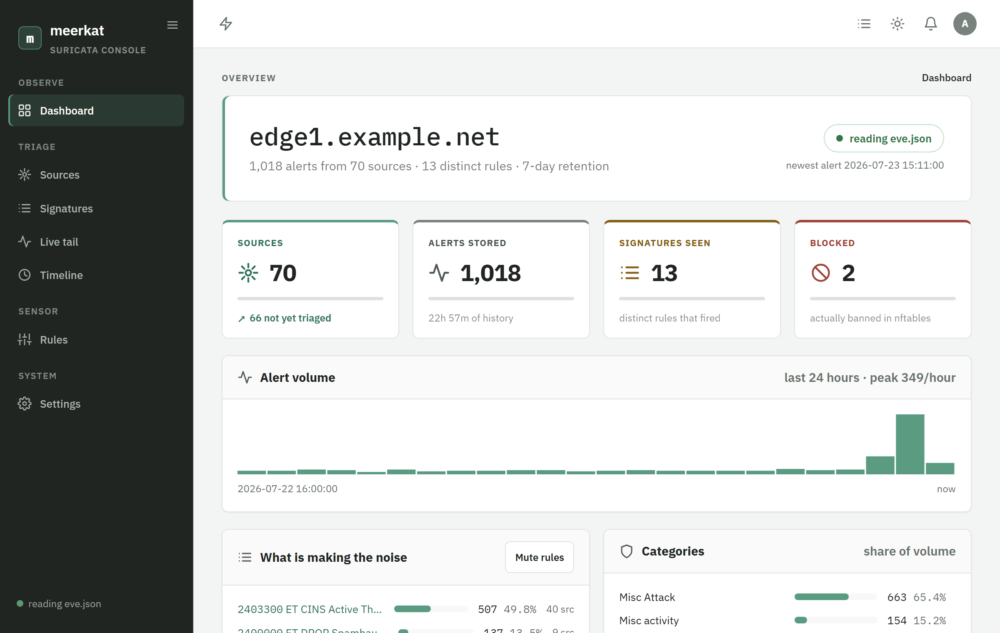
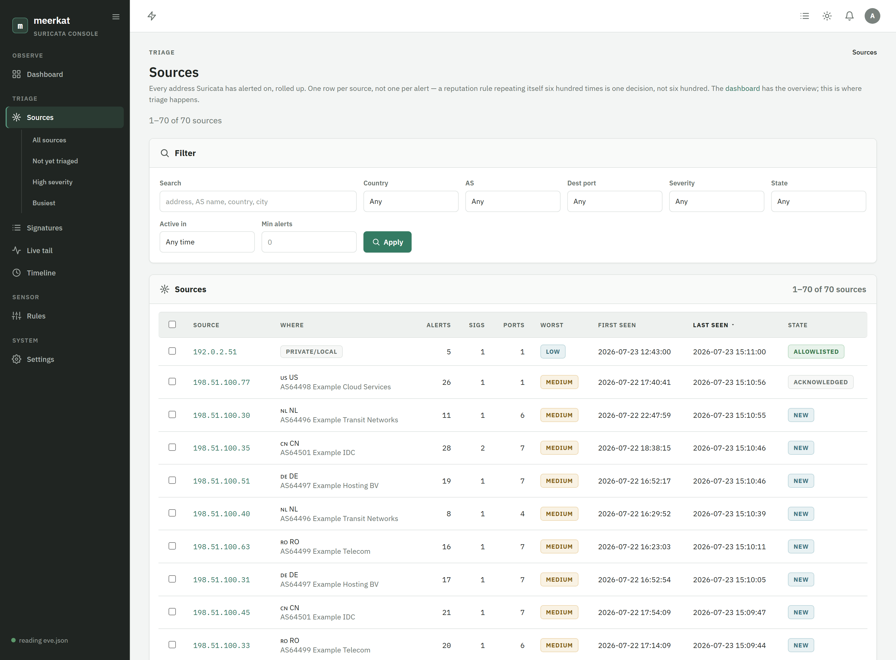
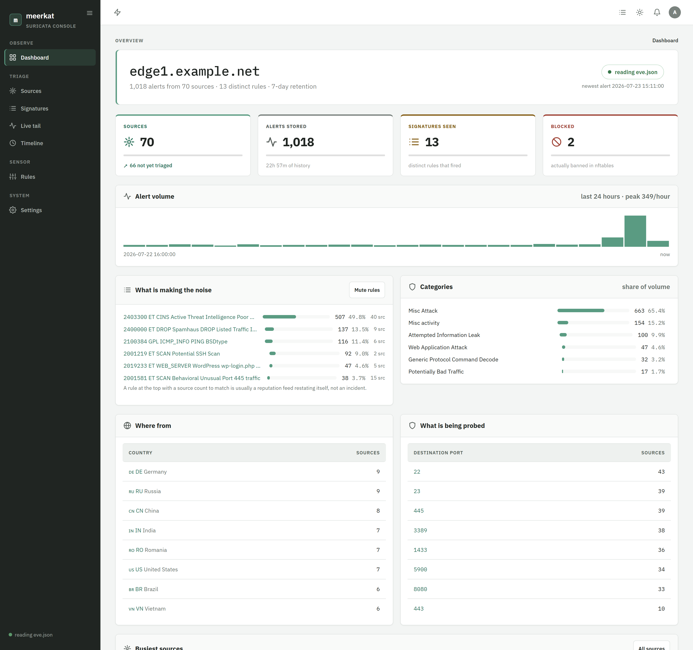
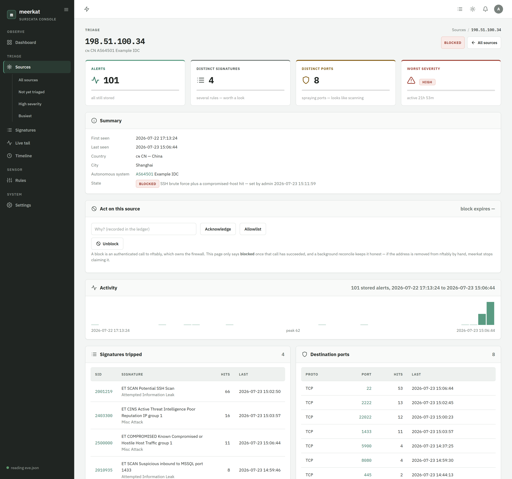
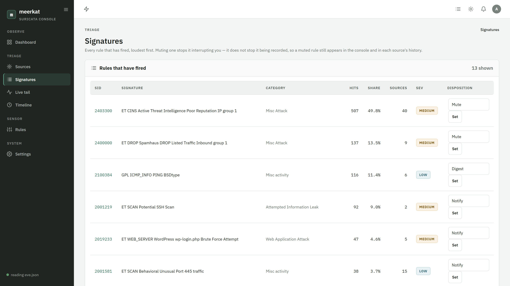
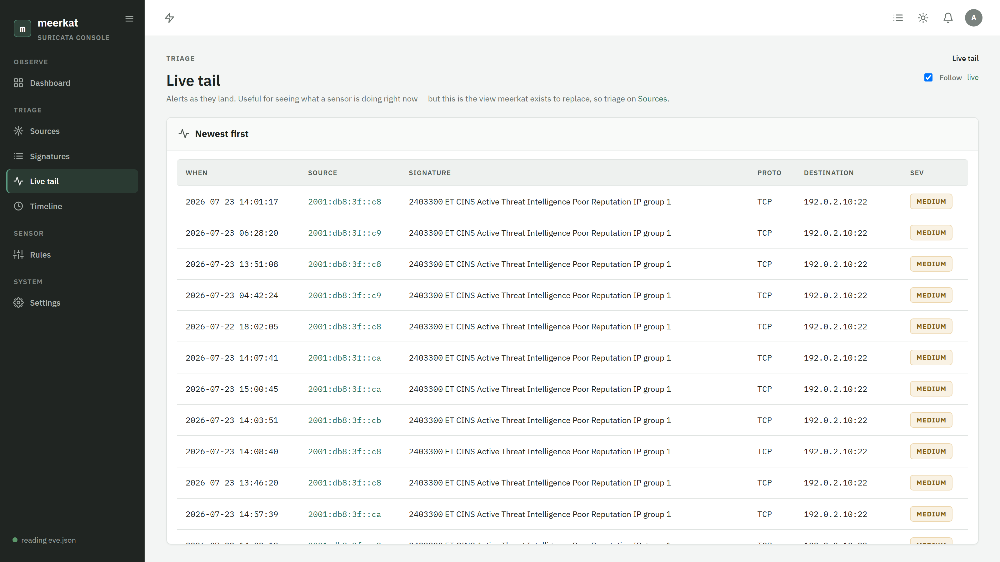
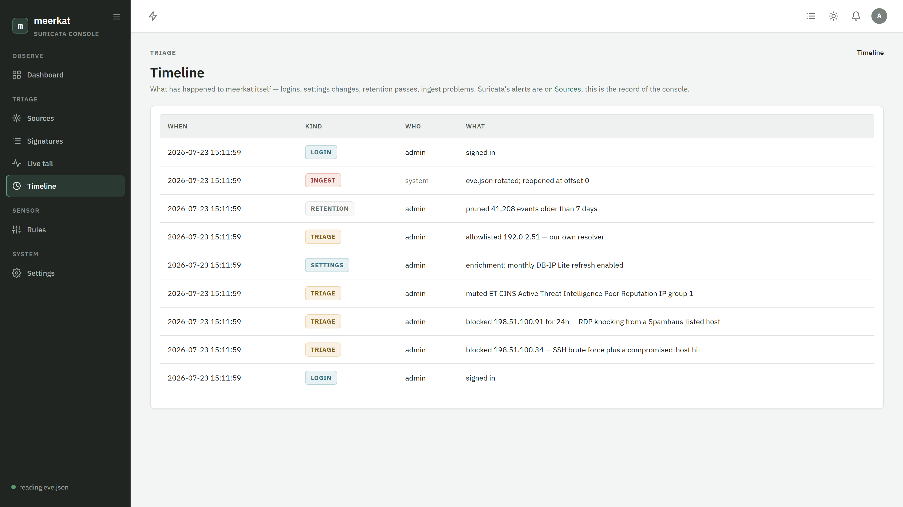
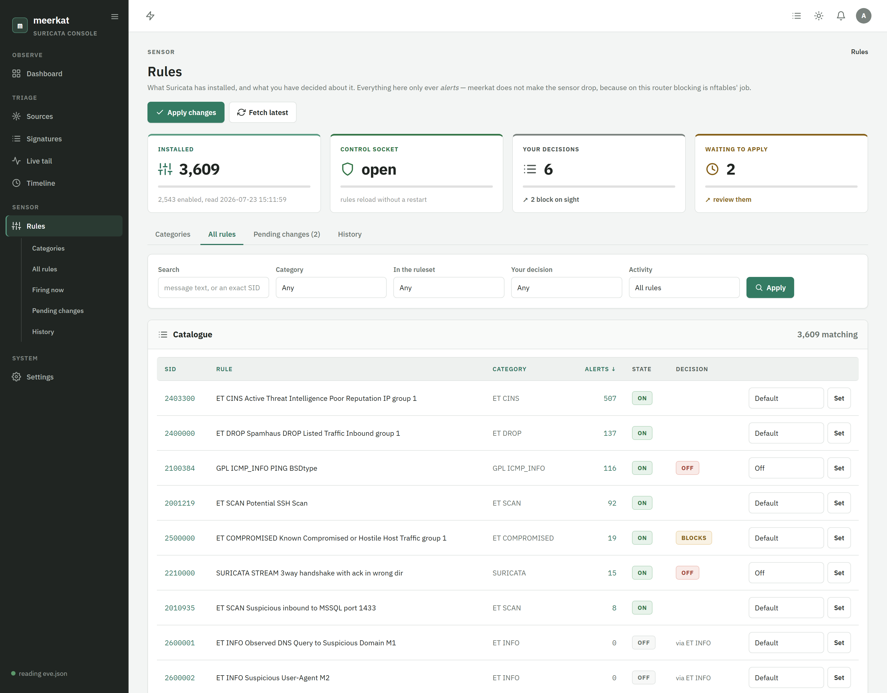
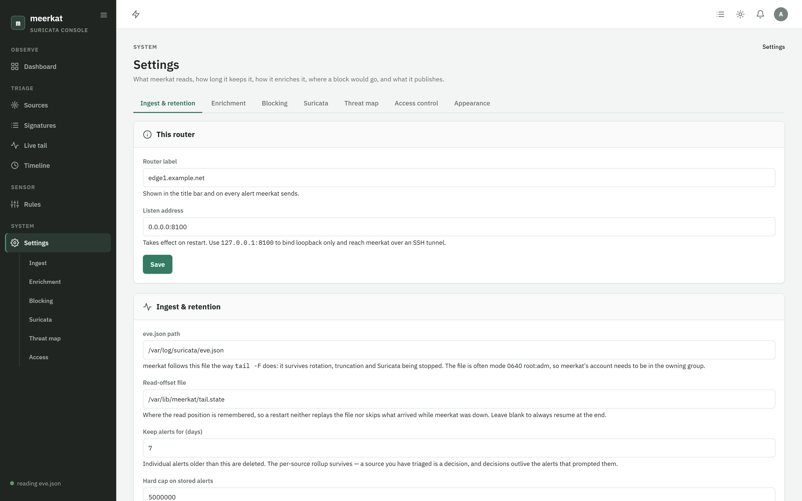
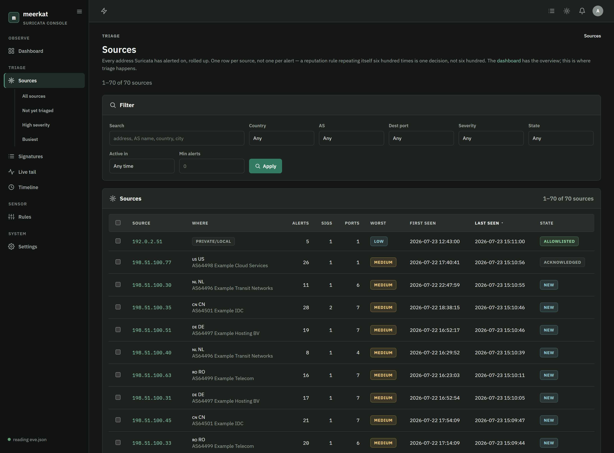

# meerkat — usage & configuration guide

Everything the [README](../README.md) points at: what meerkat needs, how to install it, every
command and flag, every setting, and what to do when a check fails.

meerkat is a console for one Suricata sensor, running on the same box as that sensor. It reads
`eve.json`, rolls every alert up per **source address**, and gives you four things to do about
each one: block, acknowledge, allowlist, or ignore.

## Contents

1. [Requirements](#1-requirements)
2. [Installing the dependencies](#2-installing-the-dependencies)
3. [Installing meerkat](#3-installing-meerkat)
4. [First run](#4-first-run)
5. [Command & flag reference](#5-command--flag-reference)
6. [The console, page by page](#6-the-console-page-by-page)
7. [Settings](#7-settings)
8. [Blocking through nftably](#8-blocking-through-nftably)
9. [Managing Suricata's ruleset](#9-managing-suricatas-ruleset)
10. [Threat-map publishing](#10-threat-map-publishing)
11. [Retention and disk](#11-retention-and-disk)
12. [Security posture](#12-security-posture)
13. [Troubleshooting](#13-troubleshooting)

---

## 1. Requirements

| | |
| --- | --- |
| **OS** | Linux (systemd for the packaged units). FreeBSD and macOS binaries are built and run, but the packaging and the rule-apply units are Linux-only. |
| **Suricata** | 6 or 7, writing JSON to `eve.json`. Not a hard dependency — meerkat is useful against a stopped sensor, and can read an `eve.json` copied off another box. |
| **CPU/RAM** | Whatever the router already has. meerkat's steady state on a sensor producing 300k alerts a day is a few tens of MB. |
| **Disk** | ~60 MB per 300k alerts. The default 7-day retention bounds it at ~450 MB. See [§11](#11-retention-and-disk). |
| **Go** | 1.25+, and only if you build from source. Releases ship static binaries. |

Optional, and each one only enables a feature:

| | |
| --- | --- |
| **DB-IP Lite `.mmdb`** | country, ASN and city enrichment. meerkat can download these itself, monthly, once you turn it on. |
| **[nftably](https://github.com/floreabogdan/nftably)** | blocking. Without it the block buttons explain themselves instead of failing. |
| **`suricata-update`** | rule management. Without it the Rules page is read-only and says why. |

### Suricata must actually be logging alerts

meerkat reads what Suricata writes. Check `/etc/suricata/suricata.yaml` has the `eve-log`
output enabled with the `alert` type:

```yaml
outputs:
  - eve-log:
      enabled: yes
      filetype: regular
      filename: eve.json
      types:
        - alert:
            payload: no
            metadata: yes
        - flow
        - stats
```

meerkat rejects `flow` and `stats` records without decoding them, so leaving them on costs
almost nothing — and they are what tells meerkat the reader is alive during a quiet minute.

> [!IMPORTANT]
> If Suricata runs **inline on NFQUEUE**, check `exception-policy`. Left at `auto` it resolves
> to drop-flow, and on the router this project was built for that silently dropped
> **258,101 of 2,676,291 packets — 9.6% of transit traffic**. Set it explicitly:
>
> ```yaml
> exception-policy: ignore
> ```

## 2. Installing the dependencies

### Suricata

```sh
# Debian / Ubuntu
sudo apt install suricata
# RHEL / Fedora
sudo dnf install suricata
```

Debian writes `/var/log/suricata/eve.json` as **`0640 root:adm`**. That is the single most
common reason meerkat sees nothing: its service account must be in the `adm` group. The `.deb`
does that for you; a manual install needs

```sh
sudo usermod -a -G adm meerkat
```

### GeoIP databases (optional)

Two ways, and you only need one:

- **Let meerkat fetch them.** Settings → Enrichment → *Refresh monthly from DB-IP*. It
  downloads the ASN, country and city Lite databases over HTTPS into meerkat's data directory,
  refuses any redirect to plaintext, caps the decompressed size, and validates the file as a
  real database before replacing a working one. Off by default: reaching the network is your
  call to make.
- **Drop the files in yourself.** Put `dbip-asn-lite.mmdb`, `dbip-country-lite.mmdb` and
  optionally `dbip-city-lite.mmdb` in `/var/lib/meerkat/` (or point Settings → Enrichment at
  another directory). MaxMind's GeoLite2 files work too — the record layouts are compatible.

Without a city database, sources have no coordinates. That is fine for the console; it is what
stops an alert reaching the threat map, which needs a point to draw.

### nftably (optional — blocking)

meerkat never touches netfilter itself. Install
[nftably](https://github.com/floreabogdan/nftably), mint an API token under its
**Settings → Automation API**, and paste the URL and token into meerkat's
**Settings → Blocking**. See [§8](#8-blocking-through-nftably).

### suricata-update (optional — rule management)

```sh
sudo apt install suricata-update    # or: pip install suricata-update
```

Already present on most Suricata installs. Without it, meerkat's Rules page shows the
catalogue but cannot apply a change, and says so in a banner rather than offering a button
that does nothing.

## 3. Installing meerkat

### Option A — the Linux package (recommended)

```sh
# Debian / Ubuntu
sudo apt install ./meerkat_<version>_amd64.deb
# RHEL / Fedora
sudo dnf install ./meerkat-<version>.x86_64.rpm
```

What the package does:

| | |
| --- | --- |
| `/usr/bin/meerkat` | the binary |
| `/lib/systemd/system/meerkat.service` | the console, unprivileged |
| `/lib/systemd/system/meerkat-apply.service` | the privileged rule-apply oneshot |
| `/lib/systemd/system/meerkat-apply.path` | watches for an apply request; **enabled and started** |
| user `meerkat`, group `meerkat` | the service account, added to `adm` |
| `/var/lib/meerkat` (0750) and `/var/lib/meerkat/suricata` | state and the apply staging directory |

It does **not** start meerkat — `meerkat init` has to create the admin account first.

`apt purge` removes the database (which holds the nftably API token and the whole triage
history); a plain `apt remove` keeps it.

### Option B — a release binary

```sh
tar -xzf meerkat_<version>_linux_amd64.tar.gz
sha256sum -c SHA256SUMS.txt --ignore-missing
sudo install meerkat /usr/local/bin/meerkat
```

Then create the account and directory the units expect:

```sh
sudo useradd --system --home-dir /var/lib/meerkat --shell /usr/sbin/nologin meerkat
sudo usermod -a -G adm meerkat
sudo mkdir -p /var/lib/meerkat/suricata
sudo chown -R meerkat:meerkat /var/lib/meerkat
sudo chmod 0750 /var/lib/meerkat
sudo cp deploy/meerkat.service deploy/meerkat-apply.service deploy/meerkat-apply.path \
        /etc/systemd/system/
sudo systemctl daemon-reload
sudo systemctl enable --now meerkat-apply.path
```

### Option C — `go install`

```sh
go install github.com/floreabogdan/meerkat/cmd/meerkat@latest
```

Or cross-compile and copy one file:

```sh
CGO_ENABLED=0 GOOS=linux GOARCH=amd64 go build -trimpath \
  -ldflags="-s -w -X github.com/floreabogdan/meerkat/internal/buildinfo.Commit=$(git rev-parse HEAD)" \
  -o meerkat ./cmd/meerkat
scp meerkat root@router:/usr/local/bin/meerkat
```

### Option D — Docker

```sh
docker run --rm -it -v meerkat-data:/var/lib/meerkat \
  ghcr.io/floreabogdan/meerkat:latest init --label edge1

docker run -d --name meerkat --restart unless-stopped \
  -p 127.0.0.1:8100:8100 \
  -v meerkat-data:/var/lib/meerkat \
  -v /var/log/suricata/eve.json:/var/log/suricata/eve.json:ro \
  --group-add "$(getent group adm | cut -d: -f3)" \
  ghcr.io/floreabogdan/meerkat:latest
```

The `--group-add` is what makes the host's `0640 root:adm` `eve.json` readable from inside the
container. Rule management does not work in a container — the privileged apply step needs the
host's `/etc/suricata` and Suricata's control socket — and the Rules page says so.

## 4. First run

```sh
sudo meerkat init          # create the database and the admin account
sudo meerkat doctor        # check everything before starting the service
sudo systemctl enable --now meerkat
```

`meerkat init` prompts for a password (minimum 8 characters). Run it under `sudo`: it hands
the database it creates to the `meerkat` account, so the service can write its own state.

`meerkat doctor` is worth reading line by line the first time. A typical healthy run:

```
[ok  ] database             /var/lib/meerkat/meerkat.db is writable
[ok  ] eve.json             /var/log/suricata/eve.json readable, last written 2s ago
[ok  ] suricata             active (running)
[warn] geoip                no databases configured — sources will have no country or AS
[warn] nftably              not configured — blocking is unavailable
[ok  ] suricata ruleset     68,005 rules, readable
[ok  ] apply path unit      meerkat-apply.path is enabled
```

Warnings are features that are off, not faults. Only `fail` lines make `doctor` exit non-zero.

Then open `http://<router>:8100` and log in.



> [!WARNING]
> meerkat is now reachable from **every interface, over plaintext HTTP**. Narrow it before you
> do anything else — Settings → Access control, or see [§12](#12-security-posture).

## 5. Command & flag reference

```
meerkat init [flags]     create the database and admin account
meerkat doctor [flags]   check eve.json, Suricata, the geo databases and nftably
meerkat passwd [flags]   set an account's password
meerkat lookup <ip>      print what the geo databases produce for an address
meerkat rules <cmd>      manage Suricata's ruleset (status, index, apply)
meerkat server [flags]   follow eve.json and serve the console
meerkat version          print the version
```

Every command takes `--db`, defaulting to `/var/lib/meerkat/meerkat.db`.

### `meerkat init`

Creates the database, the admin account, and the settings row. Refuses to run twice.

| flag | default | what it does |
| --- | --- | --- |
| `--db` | `/var/lib/meerkat/meerkat.db` | where the database goes. Its directory also becomes the data directory (GeoIP files, read-offset, apply staging). |
| `--listen` | `0.0.0.0:8100` | the address the console binds. Stored in settings; `meerkat server --listen` overrides it for one run. |
| `--label` | *(empty)* | a friendly name for this router, shown in the title bar and on every alert meerkat sends. |
| `--eve` | `/var/log/suricata/eve.json` | the file to follow. |
| `--retention-days` | `7` | how many days of individual alerts to keep. Rollups are never pruned. |
| `--username` | `admin` | the admin account name. |
| `--password` | *(prompt)* | prefer the prompt: a flag lands in shell history. Minimum 8 characters. |

### `meerkat doctor`

Runs the preflight checks and exits non-zero if any **failed**. Safe to run at any time,
including against a running service.

| flag | default | what it does |
| --- | --- | --- |
| `--db` | `/var/lib/meerkat/meerkat.db` | reads the stored settings, so the checks cover what the service will actually use rather than the compiled-in defaults. |
| `--eve` | *(from settings)* | check a different file. |
| `--suricata-unit` | `suricata` | the systemd unit to ask about. |

Run it **as the user meerkat runs as** — that is the whole point of the `eve.json` check:

```sh
sudo -u meerkat meerkat doctor
```

### `meerkat server`

Follows `eve.json` and serves the console. This is what the systemd unit runs.

| flag | default | what it does |
| --- | --- | --- |
| `--db` | `/var/lib/meerkat/meerkat.db` | the database. |
| `--listen` | *(from settings)* | override the bind address for this run. `127.0.0.1:8100` is the closed posture. |
| `--eve` | *(from settings)* | override the file to follow. |
| `--from-start` | `false` | read the whole file instead of resuming from the stored offset. Use it after pointing meerkat at an `eve.json` copied off another box. |
| `--tls-cert` / `--tls-key` | *(none)* | PEM certificate and key for native HTTPS (TLS 1.2 minimum). Must be given together. |

It refuses to start if the database exists but is not writable by the user it runs as — the
usual cause being `meerkat init` run as root while the service runs as `meerkat` — and tells
you the `chown` that fixes it.

### `meerkat passwd`

Resets an account's password from the console, and signs out every existing session for it.
It deliberately does not ask for the current password: anyone who can run this can already
rewrite the database file directly, so demanding the old one would protect nothing and lock
out the exact case the command exists for.

| flag | default |
| --- | --- |
| `--username` | `admin` |
| `--password` | *(prompt)* |

### `meerkat lookup`

Prints what the configured GeoIP databases actually produce for one or more addresses.
Enrichment fails silently by design — a database that loads but decodes to nothing yields
empty fields, not an error — so this is how you tell "no city database" from "this address is
not in it".

```sh
$ meerkat lookup 198.51.100.34
databases: asn:DBIP-ASN-Lite country:DBIP-Country-Lite

198.51.100.34
  summary     🇨🇳 CN · AS64501 Example IDC
  country     CN (China)  continent AS
  city        —
  coordinates none — this address cannot be plotted on the threat map
  asn         AS64501 Example IDC
  private     false
```

`--asn-db`, `--country-db` and `--city-db` override the configured paths.

### `meerkat rules`

```
meerkat rules status     what is installed, and what is waiting to be applied
meerkat rules index      re-read the built ruleset into meerkat's catalogue
meerkat rules apply      install the staged filters, rebuild, and reload
```

`apply` **needs root**: it writes `/etc/suricata`, runs `suricata-update`, and talks to
Suricata's control socket. It is normally started by the `meerkat-apply` systemd unit when the
console asks for a change, so you should rarely run it by hand. `--force` rebuilds even when
the upstream ruleset has not changed; `--reason` is recorded in the run history.

## 6. The console, page by page

### Sources — the home of the product



Every address Suricata has alerted on, one row each. The columns are the ones a decision
actually needs: alerts, distinct signatures, distinct ports, worst severity, first and last
seen, triage state.

- **Filter** by free text (address, AS name, country, city), country, AS, destination port,
  signature SID, severity, state, time window, and a minimum alert count that hides one-off
  noise.
- **Sort** by any column. Counts and timestamps start descending, because during an incident
  "biggest first" is what you want; the address column starts ascending.
- **Select rows** and act on all of them at once — block, acknowledge, allowlist — with one
  reason and one expiry.
- The **"what is making the noise"** card names the handful of rules producing most of the
  volume, and the source count beside each one is the tell: a rule at the top with a source
  count to match is a reputation feed restating itself, not an incident.

The sidebar's saved views (*Not yet triaged*, *High severity*, *Busiest*) are the three
filters worth having a shortcut to.

### Dashboard — the overview



Volume over 24 hours, what is making the noise, the category breakdown, where traffic comes
from, what is being probed, and the busiest sources. Nothing here is a list of events; every
number comes from the per-source and per-signature rollups.

The pill at the top right is the reader's health. **`reading eve.json`** means the tailer has
seen a line recently. **`ingest degraded`** means it is running but nothing has arrived for ten
minutes — on a live link Suricata writes flow records constantly, so that only happens when
something is wrong. **`reader stopped`** means it is not running at all.

### Source detail



Everything known about one address: activity over time, which signatures it tripped and how
often, which ports, its geo/AS identity, the individual alerts with their decoded protocol
context (HTTP host and URL, TLS SNI, DNS name, SSH client), and the ledger of every action
taken against it — who, when, why, and what nftably said back.

The alert count on this page can be smaller than the source's lifetime count. That is
retention working as designed, and the page says which number is which rather than quietly
disagreeing with itself.

### Signatures



Every rule meerkat has seen fire, with its hit count, how many distinct sources tripped it, and
its **disposition**: *notify*, *digest*, or *mute*. Muting changes what interrupts you, not
what is kept — a muted rule's alerts are still stored, still counted, and still visible on
every source page.

### Live tail



The raw stream, deliberately a secondary page. Watching alerts scroll past is how you learn
what a sensor is doing; it is not how you triage.

### Timeline



What has happened to **meerkat itself** — logins, settings changes, triage decisions, retention
passes, ingest problems. Suricata's alerts are on the Sources page; this is the record of the
console, attributed to the user who did it.

### Rules



See [§9](#9-managing-suricatas-ruleset).

## 7. Settings



Everything lives in the database and is edited here, so there is no config file to drift.

### Ingest & retention

| | |
| --- | --- |
| **Router label** | shown in the title bar and on every alert meerkat sends. |
| **Listen address** | takes effect on restart. `127.0.0.1:8100` binds loopback only. |
| **eve.json path** | the file to follow. |
| **Read-offset file** | where the read position is remembered, so a restart neither replays the file nor skips what arrived while meerkat was down. Blank means "always resume at the end". |
| **Keep alerts for (days)** | individual alerts older than this are deleted. The per-source rollup survives. |
| **Hard cap on stored alerts** | the flood backstop, for a burst that would blow through the retention window early. |

### Enrichment

The GeoIP directory and, optionally, explicit paths to each `.mmdb`. *Refresh monthly from
DB-IP* is the opt-in downloader. The panel reports which databases actually loaded — a file
that is present but unreadable is a real fault and shows as one, while a missing file at a
guessed path just means "not installed".

### Blocking

nftably's base URL and API token. See [§8](#8-blocking-through-nftably).

### Suricata

Where the ruleset and Suricata's config live, whether to fetch new rules on a schedule and at
what hour, and whether rules are allowed to **block on sight** — plus a cap on how many
addresses that may block per hour. Both the schedule and block-on-sight are off until you turn
them on.

### Threat map

See [§10](#10-threat-map-publishing).

### Access control

The IP/CIDR allow-list. See [§12](#12-security-posture).

### Appearance

**Light / dark / system**, plus an accent colour. Saved on your account rather than in the
browser, so it follows you across machines, and carried to the page in a cookie the pre-paint
script reads — which is what stops a dark-mode operator seeing a white flash on every
navigation.



## 8. Blocking through nftably

meerkat never touches netfilter. A block is an authenticated `POST /api/block` to
[nftably](https://github.com/floreabogdan/nftably), which owns that decision, adds the address
to a named set, and pushes it to the live kernel set.

1. In nftably: **Settings → Automation API**, mint a token.
2. In meerkat: **Settings → Blocking**, paste the base URL (e.g. `http://127.0.0.1:8099`) and
   the token. Leave the token field blank on a later save to keep the stored one.
3. The block buttons appear across the console.

Three things follow from doing it this way:

- **A source is marked blocked only once nftably has confirmed it.** A failed call leaves the
  source in whatever state it was really in, and the ledger records what the far end said.
- **meerkat reconciles every two minutes** against nftably's real blacklist. Remove an address
  there by hand and meerkat stops claiming it is blocked.
- **A timed block is nftably's to expire**, and meerkat's to notice. Blocks with a TTL show
  their expiry on the source page.

> Until a token exists in nftably, its `/api/block` returns **404**, not 401 — the endpoint is
> not mounted at all. `meerkat doctor` reports that as "not configured" rather than
> "unauthorised", because they mean different things.

## 9. Managing Suricata's ruleset

The console holds no capabilities. It cannot write `/etc/suricata`, cannot run
`suricata-update`, and cannot open Suricata's root-owned control socket — so an apply is a
handoff to a root oneshot started by a path unit. The README has
[the diagram](../README.md#changing-rules-without-running-as-root).

### The catalogue

**Rules → All rules** is every signature in the file Suricata actually loaded, joined to how
much each has cost you. `ON`/`OFF` is the state **in the built ruleset** — the fact. The
*Decision* column is your intent. When those two disagree, the rule is waiting to be applied.

### Making a decision

Per rule, or per category:

| | |
| --- | --- |
| **Off** | commented out of the ruleset on the next apply. |
| **On** | force-enabled, even if upstream ships it disabled. |
| **Block on sight** | when this rule fires, push the source address to nftably. Optionally with a TTL. **This is never a Suricata `drop`.** |
| **Severity override** | change what meerkat records for this rule's alerts, so a rule you consider serious sorts to the top. |

A decision outlives the catalogue: a rule dropped from ET Open and reinstated six months later
comes back muted, because muting it was a decision and the catalogue is only an observation.

### Applying

Press **Apply changes**. meerkat renders `disable.conf` and `enable.conf` into
`/var/lib/meerkat/suricata/`, writes `apply.request`, and waits. `meerkat-apply.path` notices,
starts `meerkat-apply.service` as root, and that installs the filter files, runs
`suricata-update`, counts the rebuilt ruleset, and reloads Suricata over its control socket.
The result is written back and the console re-indexes **from the file on disk**.

That last step is the point. `suricata-update` keeps a disabled rule alive when an enabled rule
depends on its flowbits, so "I disabled 299 rules" and "299 rules are disabled" are different
claims, and the console only ever makes the second one. Anything it asked for and did not get
shows on **Pending changes** as *refused*.

### Two normal-looking problems that are not problems

- **"Control socket unreachable."** Expected. Suricata creates it `0660 root:root` and the
  console runs unprivileged. The apply step runs as root and reaches it fine. The tile
  distinguishes this from "the socket is there but nothing is listening" (Suricata is stopped)
  and "no socket at all" (stopped, or `unix-command` is disabled in `suricata.yaml`).
- **"Read-only: suricata-update is not installed."** Install it, or accept that the catalogue
  is a view rather than a control.

If `meerkat-apply.path` is **not** enabled, a change is staged and nothing picks it up. The
Rules page says so after fifteen minutes rather than spinning forever, and `meerkat doctor`
checks it.

## 10. Threat-map publishing

Off by default. When enabled, meerkat publishes gzipped batches of detections to a collector
you name, reading forward from a persisted cursor so a restart neither replays history nor
skips.

What it will not do:

- **It never carries a destination address.** A detection is reported as a site name plus a
  port. That is the whole reason the feature has a rule of its own in the README.
- **It withholds your own networks.** Anything inside the *our networks* prefix list is
  dropped before the batch is built. If that list does not parse, publishing is **disabled**
  rather than degraded — a malformed exclusion list is exactly how a customer address ends up
  public.

  > [!IMPORTANT]
  > The default list is **private and carrier-internal space only** (RFC 1918, CGNAT,
  > link-local, ULA). meerkat cannot guess your public prefixes, so **add them yourself**
  > under Settings → Threat map before you enable publishing. Until you do, a detection
  > against one of your own public hosts is publishable.
- **It does not backfill.** A publisher that has never run starts at "now"; replaying a full
  retention window onto a public map on first enable would be a surprise.

A source with no coordinates cannot be plotted and is not published — that needs a **city**
database, not just country. `meerkat lookup <ip>` tells you which you have.

## 11. Retention and disk

An alert row is roughly 200 bytes. A sensor producing 300k alerts a day is ~60 MB/day, so the
default 7-day window bounds the events table at ~450 MB. `max_events` is the backstop for a
flood that would fill the disk well inside that window.

The exact `eve.json` line is deliberately **not** stored. At that volume it is hundreds of
megabytes a day of near-duplicate JSON, and everything triage needs is already a column, with
the varying protocol context kept in a small blob beside it.

Pruning removes **events**, never rollups. A source you triaged three weeks ago is still there,
still blocked, with its reason and its ledger — the alerts that prompted the decision are gone,
and the source page says so.

To reclaim disk after lowering retention:

```sh
sudo systemctl stop meerkat
sudo -u meerkat sqlite3 /var/lib/meerkat/meerkat.db 'VACUUM;'
sudo systemctl start meerkat
```

## 12. Security posture

meerkat parses hostile input by design: `eve.json` is a record of what attackers are doing, and
the signature names, addresses and protocol fields in it are attacker-influenced. See
[`SECURITY.md`](../SECURITY.md) for the full threat model.

### Close the front door

Out of the box meerkat binds `0.0.0.0:8100` with **no TLS**. Pick one:

**Access list** (Settings → Access control) — one IP or CIDR per line. A client outside it has
its connection **closed with no response at all**, so a scanner cannot tell there is a service
listening. Loopback is always allowed, so this cannot lock you out of an SSH tunnel.

```
203.0.113.0/24
2001:db8:1::/48
```

**Native TLS** — pass a PEM certificate and key:

```sh
meerkat server --tls-cert /etc/ssl/meerkat.crt --tls-key /etc/ssl/meerkat.key
```

**Closed, with a tunnel** — the strongest and simplest:

```sh
meerkat server --listen 127.0.0.1:8100
ssh -L 8100:127.0.0.1:8100 router      # then browse to http://127.0.0.1:8100
```

An allow-list is not encryption. On a public address the login and session cookie cross the
network in the clear, and an allow-list does nothing about interception — only about who may
connect.

### What is stored

The database holds the admin password hash, session tokens, the nftably API token, and the full
alert history. Treat it as a secret; the unit keeps its directory `0750` and owned by the
service account.

- Passwords are bcrypt at the default cost.
- Session tokens are 32 bytes of CSPRNG output, stored only as their SHA-256 hash — a database
  read does not yield usable bearer tokens.
- The nftably API token is stored as-is, because it has to be replayed to nftably. It is never
  rendered back into the settings form.

### Privilege

The service account holds **no Linux capabilities**. The unit sets `NoNewPrivileges`,
`ProtectSystem=strict`, `PrivateDevices`, `MemoryDenyWriteExecute` and a restricted
address-family set. It reads `eve.json` through group membership (`adm`) and reaches nftably
over HTTP.

Compromising meerkat does not directly grant the ability to alter netfilter: a block is an
authenticated HTTP call to a separate service that owns that decision, and every attempt is
recorded.

## 13. Troubleshooting

### The console is empty and nothing arrives

Run `sudo -u meerkat meerkat doctor` — as the service account, not as root. The usual causes,
in order of likelihood:

1. **`eve.json` is not readable.** Debian ships it `0640 root:adm`. Fix with
   `sudo usermod -a -G adm meerkat && sudo systemctl restart meerkat`.
2. **Suricata is not writing alerts.** Check `eve-log` is enabled with the `alert` type, and
   that `HOME_NET` is right — a `HOME_NET` covering the whole internet produces alerts on
   everything, and one covering nothing produces none.
3. **Wrong path.** Settings → Ingest, or `--eve`.
4. **meerkat is running but resumed at the end of a file that has not grown.** `--from-start`
   reads the whole file once.

The dashboard pill and the sidebar dot tell you which of these it is: `reader stopped` means
the tailer is not running at all; `ingest degraded` means it is running and nothing has
arrived.

### "the database is not writable by the user meerkat runs as"

`meerkat init` was run as root and the service runs as `meerkat`. The error prints the fix:

```sh
sudo chown -R meerkat:meerkat /var/lib/meerkat
```

### Sources have no country or AS

No GeoIP databases. Settings → Enrichment, either turn on the monthly refresh or drop the
`.mmdb` files in `/var/lib/meerkat/`. `meerkat lookup 1.1.1.1` shows what is actually loaded.

### The block button is missing, or says blocking is unavailable

nftably's URL or token is not set (Settings → Blocking), or nftably has no Automation API token
minted so its `/api/block` is not mounted. `meerkat doctor` distinguishes the two.

### A rule change is stuck at "waiting"

`meerkat-apply.path` is probably not enabled:

```sh
sudo systemctl enable --now meerkat-apply.path
sudo systemctl status meerkat-apply.service   # what happened on the last run
```

Or run the privileged half by hand to see the error directly:

```sh
sudo meerkat rules apply --reason "debugging"
```

### I forgot the admin password

```sh
sudo meerkat passwd --username admin
```

Every existing session for that account is signed out.

### Where are the logs?

```sh
sudo journalctl -u meerkat -f
sudo journalctl -u meerkat-apply -n 100
```

meerkat logs structured lines to stderr, which systemd captures. It never logs the nftably
token or a password.
